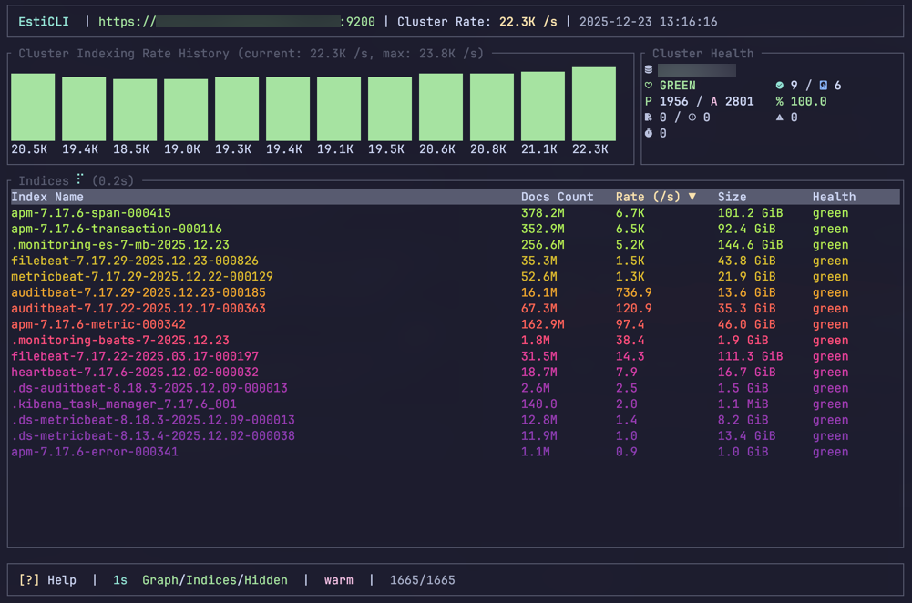

<div align="center">


</div>

# EstiCLI
**(/ˈɛs.tɪ.kliː/ - like "broccoli"  🥦 but for Elasticsearch)**

[](https://www.rust-lang.org/) [](LICENSE) [](CONTRIBUTING.md)

A `top`-like TUI for real-time monitoring of Elasticsearch index ingestion rates.



## Features

- **Real-time Monitoring** - Live average indexing rates (docs/sec) for all indices
- **Cluster Overview** - Graph showing cluster-wide average ingestion history
- **Cluster Health** - shows global cluster metrics (shards, tasks, health etc.)
- **Smart Sorting** - Sort by name, document count, rate, size or health with visual gradient
- **jq Filtering** - Filter indices using jq syntax with real-time validation
- **Index Details** - Deep-dive popup with info on shards, ILM policy, templates and data streams
- **Index Exclusion** - Temporarily exclude "noisy" indices from stats
- **Flexible Auth** - Basic auth, API keys, and custom CA certificates
- **Keyboard-Driven** - Vim-style navigation throughout

## Installation

### From Source

```bash
git clone https://github.com/nocturnal3d/esticli.git
cd esticli
cargo build --release
./target/release/esticli
```

### Cargo

```bash
cargo install esticli
```

## Usage

```bash
# Get CLI Help
esticli --help

# Connect to remote cluster
esticli -u https://elasticsearch.example.com:9200

# With basic authentication
esticli -u https://es.example.com:9200 --username elastic --password secret

# With API key
esticli -u https://es.example.com:9200 --api-key "base64encodedapikey"

# Skip TLS verification (development only)
esticli -u https://localhost:9200 -k

# Custom CA certificate
esticli -u https://es.example.com:9200 --ca-cert /path/to/ca.pem

# Custom refresh interval
esticli --refresh 10

# Custom colormap (inferno, magma, plasma, viridis, turbo, spectral, rainbow, cividis, warm, cool)
esticli --colormap magma

# Increase rate averaging samples (smoother rates, default: 3)
esticli --rate-samples 5
```

### CLI Options

| Option               | Description                             | Default                 |
|----------------------|-----------------------------------------|-------------------------|
| `-u, --url <URL>`    | Elasticsearch URL                       | `http://localhost:9200` |
| `--username <USER>`  | Basic auth username                     | -                       |
| `--password <PASS>`  | Basic auth password                     | -                       |
| `--api-key <KEY>`    | API key for authentication              | -                       |
| `-k, --insecure`     | Skip TLS certificate verification       | `false`                 |
| `--ca-cert <FILE>`   | Path to CA certificate (PEM format)     | -                       |
| `--refresh <SECS>`   | Refresh interval in seconds             | `5`                     |
| `--colormap <NAME>`  | Colormap for gradient (see below)       | `warm`                  |
| `--rate-samples <N>` | Samples to average for rate calculation | `10`                    |


### Available Colormaps

| Colormap   | Description                                            |
|------------|--------------------------------------------------------|
| `inferno`  | Perceptually uniform, black-red-yellow-white (default) |
| `magma`    | Perceptually uniform, black-purple-orange-white        |
| `plasma`   | Perceptually uniform, blue-purple-orange-yellow        |
| `viridis`  | Perceptually uniform, blue-green-yellow                |
| `turbo`    | Rainbow-like, blue-cyan-green-yellow-red               |
| `spectral` | Diverging, red-orange-yellow-green-blue                |
| `rainbow`  | Classic rainbow spectrum                               |
| `cividis`  | Colorblind-friendly, blue-yellow                       |
| `warm`     | Warm tones, pink-orange-yellow                         |
| `cool`     | Cool tones, cyan-blue-purple                           |


## Keybindings

### Navigation

| Key             | Action              |
|-----------------|---------------------|
| `j` / `↓`       | Move selection down |
| `k` / `↑`       | Move selection up   |
| `PgUp` / `PgDn` | Page up/down        |
| `g` / `Home`    | Go to first index   |
| `G` / `End`     | Go to last index    |


### Actions

| Key         | Action                                    |
|-------------|-------------------------------------------|
| `Enter`     | Show index details                        |
| `x`         | Exclude/include selected index from stats |
| `X`         | Clear all exclusions                      |
| `/`         | Enter filter mode (jq)                    |
| `Space`     | Pause/resume refresh                      |
| `?`         | Show help                                 |
| `q` / `Esc` | Quit                                      |


### Sorting

| Key                     | Action             |
|-------------------------|--------------------|
| `←` / `→` or  `h` / `l` | Change sort column |
| `r`                     | Reverse sort order |


### Display

| Key         | Action                               |
|-------------|--------------------------------------|
| `1`         | Toggle graph visibility              |
| `2`         | Toggle health visibility             |
| `3`         | Toggle indices table visibility      |
| `.`         | Toggle system indices (dot-prefixed) |
| `+` / `-`   | Increase/decrease refresh interval   |
| `c` / `C`   | Cycle colormap forward/backward      |


### Filter Mode

| Key                    | Action            |
|------------------------|-------------------|
| `←` / `→`              | Move cursor       |
| `Ctrl+←` / `Ctrl+→`    | Move by word      |
| `Home` / `End`         | Jump to start/end |
| `Backspace` / `Delete` | Delete characters |
| `Ctrl+u`               | Clear filter      |
| `Esc` / `Enter`        | Exit filter input |


### Filter Syntax (jq)

Filters use [jq](https://jqlang.github.io/jq/) syntax. Available fields: `.name`, `.doc_count`, `.rate_per_sec`, `.health`, `.size_bytes`

| Filter                                | Description              |
|---------------------------------------|--------------------------|
| `select(.name == "my-index")`         | Exact name match         |
| `select(.doc_count > 1000)`           | Docs greater than 1000   |
| `select(.health != "green")`          | Non-green health status  |
| `select(.rate_per_sec > 5)`           | High ingestion rate      |
| `select(.name \| contains("test"))`   | Name contains "test"     |
| `select(.name \| test(".*test$"))`    | Name matches regex              |
| `select(.doc_count > 100 and .health == "green")` | Combined conditions |


## Index Details

Press `Enter` on any index to view detailed information:

- **Health & Status** - Current index health (green/yellow/red)
- **Documents & Size** - Total doc count and storage size
- **Index Rate** - Current ingestion rate
- **Shards** - Primary and replica shard allocation across nodes
- **ILM Policy** - Index lifecycle management policy and current phase
- **Data Stream** - Associated data stream info (if applicable)
- **Templates** - Matching index templates
- **Segments** - Total segment count

## Requirements

- Elasticsearch 7.x or 8.x
- Rust 1.70+ (for building from source)
- Terminal with Unicode support

## Building from Source

```bash
# Clone the repository
git clone https://github.com/nocturnal3d/esticli.git
cd esticli

# Build in release mode
cargo build --release

# Install locally
cargo install --path .
```

## Architecture

```
src/
├── main.rs          # Entry point, CLI parsing, action mapping loop
├── error.rs         # Custom error types and Result alias
├── app/             # Application state and business logic
│   ├── mod.rs       # Main App struct and action handling
│   ├── actions.rs   # UI command definitions (Action enum)
│   ├── filter.rs    # Filtering logic
│   ├── sort.rs      # Sorting logic
│   └── details.rs   # Index details logic
├── models.rs        # Shared data models and state structs
├── utils.rs         # Utility functions
├── elasticsearch/   # Elasticsearch API interaction
│   ├── client.rs    # HTTP client and auth
│   ├── details.rs   # Index details fetching
│   ├── stats.rs     # Cluster stats fetching
│   ├── types.rs     # Elasticsearch-specific types
│   └── mod.rs       # Module definition
└── ui/              # User Interface modules
    ├── mod.rs       # Main layout and rendering entry
    ├── chart.rs     # Sparkline charts
    ├── table.rs     # Indices table widget
    ├── health.rs    # Cluster health metrics widget
    ├── details_popup.rs # Index details popup
    ├── help_popup.rs    # Help popup
    ├── header.rs    # Application header
    ├── footer.rs    # Application footer
    ├── theme.rs     # UI theme definitions
    └── types.rs     # UI specific types
```


## Contributing and Changelog

[Changelog](CHANGELOG.md)

Contributions are welcome! Please check out our [Contributing Guidelines](CONTRIBUTING.md) for details on how to get started, development setup, and coding standards.

## License

This project is licensed under the MIT License - see the [LICENSE](LICENSE) file for details.

## Acknowledgments

- [Ratatui](https://github.com/ratatui/ratatui) - Terminal UI framework
- [crossterm](https://github.com/crossterm-rs/crossterm) - Cross-platform terminal manipulation
- [tui-input](https://github.com/sayanarijit/tui-input) - Text input widget
- [colorgrad](https://github.com/mazznoer/colorgrad-rs) - Color gradient library
- [human_format](https://github.com/BobGneu/human-format-rs) - Number formatting
- [tokio](https://github.com/tokio-rs/tokio) - Async runtime
- [reqwest](https://github.com/seanmonstar/reqwest) - HTTP client
- [clap](https://github.com/clap-rs/clap) - Command-line argument parsing
- [serde](https://github.com/serde-rs/serde) - Serialization framework
- [serde_json](https://github.com/serde-rs/json) - JSON support for Serde
- [anyhow](https://github.com/dtolnay/anyhow) - Flexible error handling
- [thiserror](https://github.com/dtolnay/thiserror) - Derived error traits
- [url](https://github.com/servo/rust-url) - URL parsing and construction
- [chrono](https://github.com/chronotope/chrono) - Date and time library
- [jaq](https://github.com/01mf02/jaq) - jq clone for JSON filtering

---

<p align="center">
  Made with :crab: Rust
</p>
